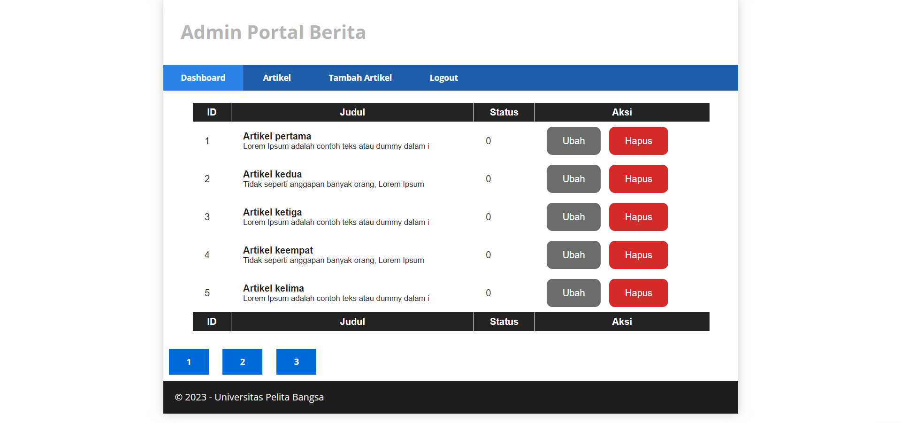
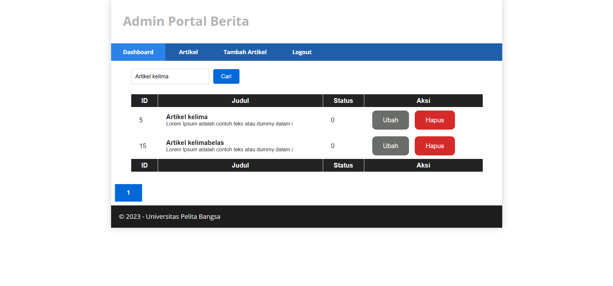

# Tugas Pemrograman Web 2
# Praktikum 10
## Profile
<body>
    <table border="1">
        <tr>
            <th> Nama</th>
            <th>NIM</th>
            <th>Kelas</th>
        </tr>
        <tr>
            <td>Muhammad Iskandar</td>
            <td>312110035</td>
            <td>TI.21.A.1</td>
        </tr>
    </table>
</body>

## Intructions
- Melanjutkan praktikum sebelumnya pada repository dengan nama Lab9Web.
- Kerjakan semua latihan yang diberikan sesuai urutannya.
- Screenshot setiap perubahannya.
- Update file README.md dan tuliskan penjelasan dari setiap langkah praktikum beserta screenshotnya.
- Commit hasilnya pada repository masing-masing.
- Kirim URL repository pada e-learning ecampus.


## Pagination
Untuk membuat pagination, buka Controller Artikel, kemudian modifikasi kode pada method admin_index seperti berikut.

```php
public function admin_index()
{
$title = 'Daftar Artikel';
$model = new ArtikelModel();
$data = [
'title' => $title,
'artikel' => $model->paginate(10), #data dibatasi 10 record
per halaman
'pager' => $model->pager,
];
return view('artikel/admin_index', $data);
}
```

*Kemudian buka file views/artikel/admin_index.php dan tambahkan kode berikut dibawah deklarasi tabel data*

```php
<?= $pager->links(); ?>
```

*Selanjutnya buka kembali menu daftar artikel, tambahkan data lagi untuk melihat hasilnya.*



## Membuat Pencarian
Untuk membuat pencarian data, buka kembali Controller Artikel, pada method admin_index ubah kodenya seperti berikut.

```php
    public function admin_index()
    {
        $title = 'Daftar Artikel';
        $q = $this->request->getVar('q') ?? '';
        $model = new ArtikelModel();
        $data = [
            'title' => $title,
            'q' => $q,
            'artikel' => $model->like('judul', $q)->paginate(5), # data dibatasi 10 record per halaman
            'pager' => $model->pager,
        ];
        return view('artikel/admin_index', $data);
    }
```

*Kemudian buka kembali file views/artikel/admin_index.php dan tambahkan form pencarian sebelum deklarasi tabel seperti berikut:*

```php
  <form method="get" class="form-search">
    <input type="text" name="q" value="<?= $q; ?>" class="text-search" placeholder="Cari data">
    <input type="submit" value="Cari" class="submit-search">
  </form>
```

- Dan pada link pager ubah seperti berikut.

```php
<?= $pager->only(['q'])->links(); ?>
```

**Uji coba dengan membuka kembali halaman admin artikel, masukkan kata kunci tertentu pada form pencarian.**



## Done

# Panjang Umur Untuk Semua Hal-Hal Baik